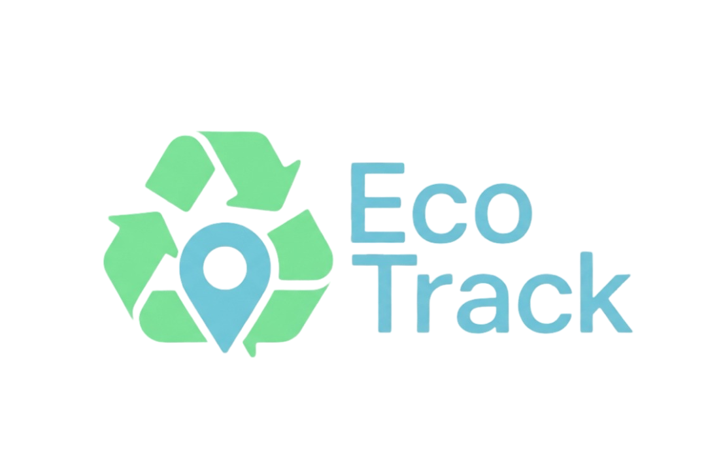
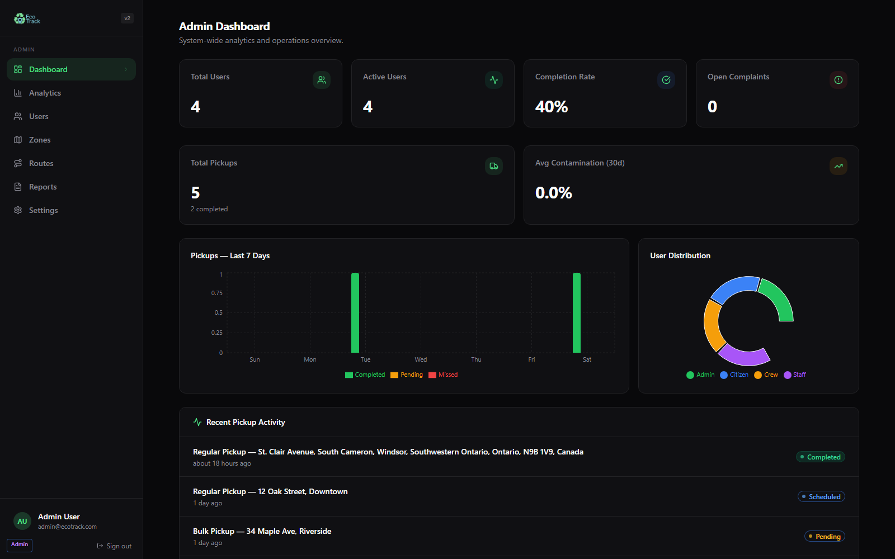
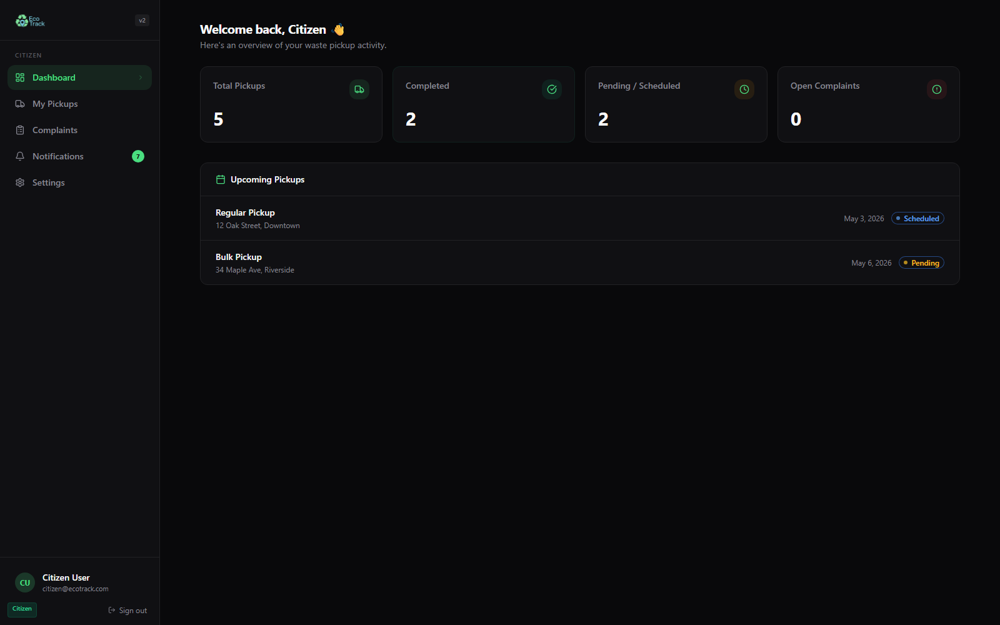
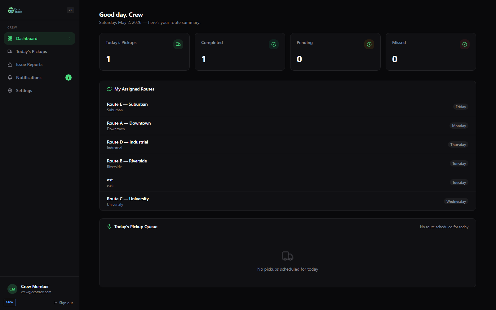
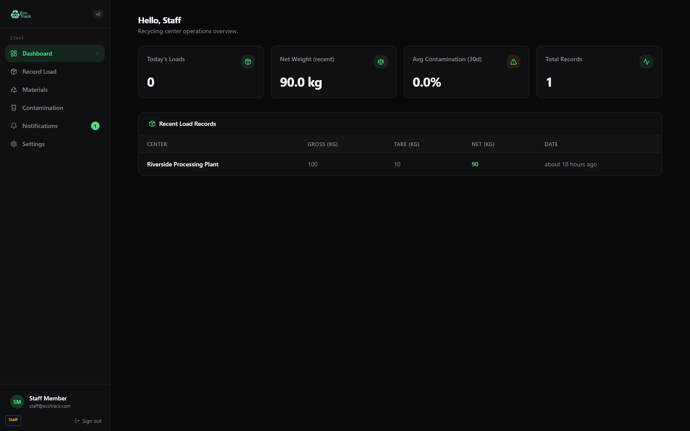
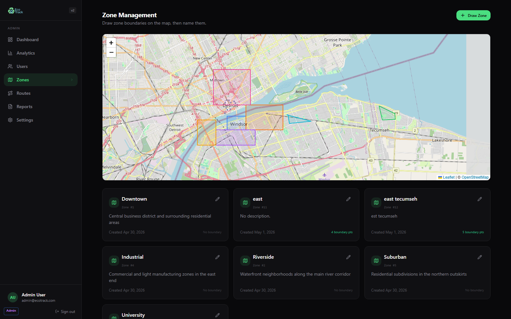
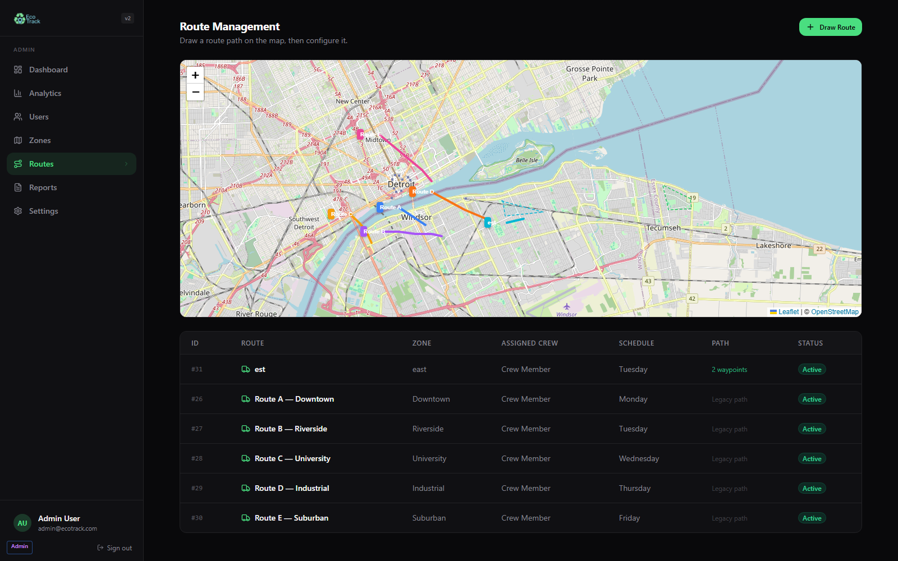

<p align="center">
  
</p>

<p align="center">
  A full-stack municipal waste and recycling operations platform built with Next.js, Supabase, and PostgreSQL.
</p>

<p align="center">
  EcoTrack gives citizens, collection crews, recycling-center staff, and administrators their own focused workspace for pickup requests, routing, issue reporting, contamination tracking, and city-wide analytics.
</p>

<p align="center">
  <a href="https://ecotrack-hassan-demo.vercel.app"><strong>Live Demo</strong></a>
  &nbsp;|&nbsp;
  <a href="https://github.com/hassanawan7890/EcoTrack"><strong>GitHub Repo</strong></a>
</p>

## Overview

EcoTrack is designed for municipalities that want one system for the full waste-management workflow:

- citizens can request pickups, track upcoming service, and submit complaints
- crews can review routes, manage daily pickups, and flag field issues
- recycling staff can log inbound loads, materials, and contamination data
- administrators can manage users, zones, routes, reports, and performance metrics

The app is built as a real Next.js application with protected role-based dashboards, API routes, Supabase Auth, and a PostgreSQL data model. It is not a static frontend demo.

## Live Demo

- App: `https://ecotrack-hassan-demo.vercel.app`
- Hosting: Vercel
- Database/Auth: Supabase PostgreSQL + Supabase Auth
- Public demo shortcuts are available directly on the login page

## Screenshots

<table>
  <tr>
    <td></td>
    <td></td>
  </tr>
  <tr>
    <td align="center"><strong>Admin Dashboard</strong></td>
    <td align="center"><strong>Citizen Dashboard</strong></td>
  </tr>
  <tr>
    <td></td>
    <td></td>
  </tr>
  <tr>
    <td align="center"><strong>Crew Dashboard</strong></td>
    <td align="center"><strong>Staff Dashboard</strong></td>
  </tr>
  <tr>
    <td></td>
    <td></td>
  </tr>
  <tr>
    <td align="center"><strong>Zones Map</strong></td>
    <td align="center"><strong>Routes Map</strong></td>
  </tr>
</table>

## Core Features

- Role-based authentication for `admin`, `citizen`, `crew`, and `staff`
- Citizen pickup requests with scheduling, status tracking, and complaint submission
- Crew dashboards for assigned routes, daily pickup queues, and issue reporting
- Recycling staff workflows for recording loads, materials, and contamination
- Admin dashboards with analytics, charts, user management, route management, and reporting
- Notifications workflow across user roles
- Leaflet-powered map tools for zones, routes, and pickup context
- Supabase-backed API routes and protected server-side pages

## Role Breakdown

### Citizen

- View upcoming pickups and historical activity
- Track request status such as `Pending`, `Scheduled`, `Completed`, and `Missed`
- Submit and monitor complaints
- Manage personal account settings

### Crew

- Review assigned routes by day
- Work through today's pickup queue
- Report operational issues from the field
- Check notifications and route-related updates

### Staff

- Record recycling-center loads
- Track gross, tare, and net weight
- Monitor contamination rates
- Manage materials and center operations data

### Admin

- View system-wide analytics and KPI cards
- Manage users and account status
- Maintain zones and routes
- Review complaint and issue reports
- Monitor pickup performance and contamination trends

## Tech Stack

- Next.js 16 App Router
- React 19
- TypeScript
- Tailwind CSS
- Supabase Auth
- Supabase PostgreSQL
- Row Level Security
- Leaflet / React Leaflet
- Recharts
- Vercel

## Project Structure

```text
src/app/(auth)         Login and registration flows
src/app/(dashboard)    Role-based dashboards and feature pages
src/app/api            Server routes and admin actions
src/components         Shared UI, layout, and map components
src/lib                Supabase clients, auth helpers, utilities
supabase/              Canonical schema, migrations, and seed data
docs/screenshots/      README image assets
scripts/               Utility scripts
```

## Getting Started

### 1. Clone the repo

```bash
git clone https://github.com/hassanawan7890/EcoTrack.git
cd EcoTrack
```

### 2. Install dependencies

```bash
npm install
```

### 3. Create your environment file

Copy `.env.example` to `.env.local` and set these values:

```env
NEXT_PUBLIC_SITE_URL=http://localhost:3000
NEXT_PUBLIC_SUPABASE_URL=https://your-project-ref.supabase.co
NEXT_PUBLIC_SUPABASE_ANON_KEY=your-public-anon-key
SUPABASE_SERVICE_ROLE_KEY=your-server-only-secret-key
```

Environment variable notes:

- `NEXT_PUBLIC_SITE_URL` should be `http://localhost:3000` locally and your live domain in production
- `NEXT_PUBLIC_SUPABASE_URL` is your Supabase project URL
- `NEXT_PUBLIC_SUPABASE_ANON_KEY` is the browser-safe public key
- `SUPABASE_SERVICE_ROLE_KEY` must stay server-only and must never use the `NEXT_PUBLIC_` prefix

### 4. Create a Supabase project

Create a new project at `https://supabase.com/dashboard`, then open the SQL Editor.

### 5. Run the database schema

Run the canonical schema file:

- `supabase/schema.sql`

If you are upgrading an older EcoTrack database, also run:

- `supabase/migrations/20260501_align_app_schema.sql`

Optional reference data:

- `supabase/seed.sql`

Important:

- `supabase/schema.sql` is the source of truth for this app
- `database/ecotrack.sql` is a legacy MySQL dump kept only for reference

### 6. Start the app

```bash
npm run dev
```

Then open `http://localhost:3000`.

## Demo Accounts

The login page includes quick-fill demo account buttons. To make those work in your own Supabase project, create these users in Supabase Auth:

- `admin@ecotrack.com` / `demo1234`
- `citizen@ecotrack.com` / `demo1234`
- `crew@ecotrack.com` / `demo1234`
- `staff@ecotrack.com` / `demo1234`

After the users exist, assign their roles in the `profiles` table:

```sql
update public.profiles
set full_name = 'Admin User', role = 'admin', is_active = true
where email = 'admin@ecotrack.com';

update public.profiles
set full_name = 'Citizen User', role = 'citizen', is_active = true
where email = 'citizen@ecotrack.com';

update public.profiles
set full_name = 'Crew Member', role = 'crew', is_active = true
where email = 'crew@ecotrack.com';

update public.profiles
set full_name = 'Staff Member', role = 'staff', is_active = true
where email = 'staff@ecotrack.com';
```

The app automatically creates a `profiles` row when a Supabase Auth user is created, so in most cases you only need to update the role and display name.

## Available Scripts

```bash
npm run dev
npm run lint
npm run typecheck
npm run build
npm run check
```

What they do:

- `npm run dev` starts the local dev server
- `npm run lint` runs ESLint
- `npm run typecheck` runs TypeScript checks
- `npm run build` creates a production build
- `npm run check` runs typecheck, lint, and build in sequence

## Deployment

### Vercel

EcoTrack is already a good fit for Vercel because it uses:

- Next.js server routes
- middleware
- protected server-rendered dashboards
- Supabase-backed admin APIs

Deploy steps:

1. Push the repo to GitHub.
2. Import the repo into Vercel.
3. Add the same environment variables from `.env.local`.
4. Set `NEXT_PUBLIC_SITE_URL` to your production URL.
5. Deploy.

Recommended Vercel environment variables:

- `NEXT_PUBLIC_SUPABASE_URL`
- `NEXT_PUBLIC_SUPABASE_ANON_KEY`
- `SUPABASE_SERVICE_ROLE_KEY`
- `NEXT_PUBLIC_SITE_URL`

### GitHub Pages

GitHub Pages is not suitable for this project in its current form because EcoTrack depends on Next.js middleware, API routes, and server-side rendering.

## Security Notes

- Never commit `.env.local`
- Never expose `SUPABASE_SERVICE_ROLE_KEY` to the browser
- Prefer a modern Supabase secret key for server-only access
- Rotate keys immediately if they are ever exposed
- Review Row Level Security policies before going live with production data

## Production Checklist

- Confirm `npm run check` passes
- Apply the latest Supabase schema or migration
- Verify demo accounts if you want public quick-fill access
- Add Vercel environment variables before first deploy
- Confirm role permissions and route protection
- Rotate any keys that were ever exposed outside a trusted environment

## License

MIT
